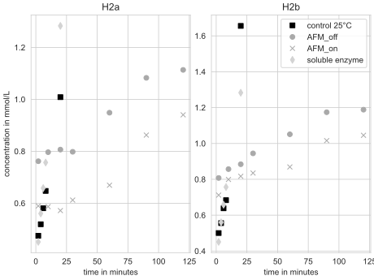

# Hotzymes data set H2a and H2b with and without exposure to an AMF

## Aim

the target of the experiment was to show if enzyme activity of BmTA (Bacillus megaterium transaminase) can be regulated by heating effects of magnetic nanoparticles under the influcence of an alternating magnetic field.

## Conclusion

A visualisation of the graphs shows that no effect on enzyme activity could be observed

 
Ressources and description

## Measurement data
The measurement and experimental details are stored in the data folder as EnzymeML documents and can be opened with https://biocathub.net

## Samples

- H2a: BmTA immobilised on silica-nanoparticles, with an enzyme previously solubilised in water

- H2b: BmTA immobilised on silica-nanoparticles, with an enzyme previously solubilised in ???

- Soluble enzyme: Soluble and purified BmTA

## Reaction setups

- control 25 °C: Reaction of H2a or H2b monitored at 25 °C
- AMF_on, AMF_off: Reaction with H2a or H2b at 5 °C with the AMF on or off
- soluble enzyme: Reaction with purified BmTA